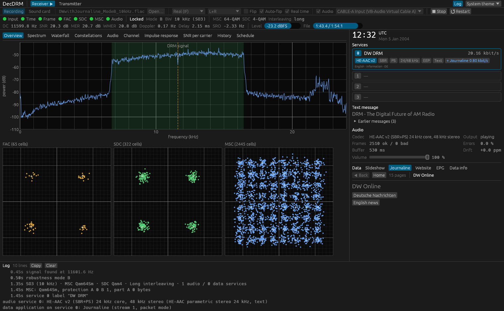
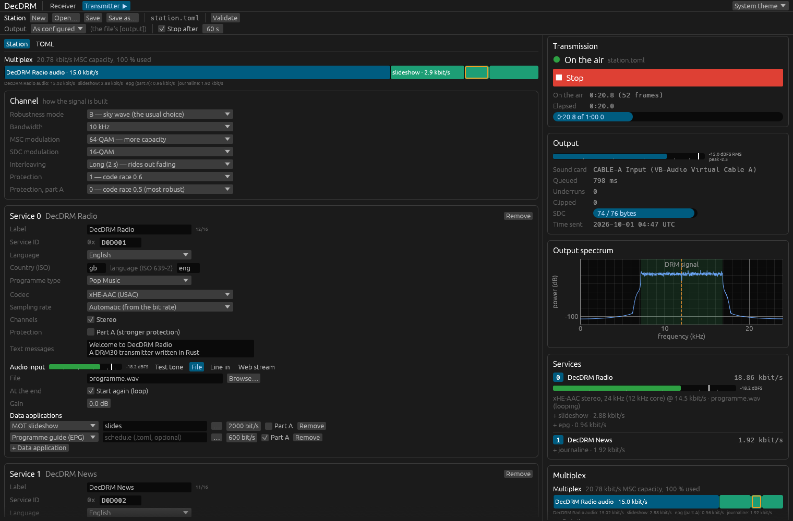

# DecDRM

A Digital Radio Mondiale (DRM30) receiver **and transmitter** written in Rust.

DecDRM decodes DRM robustness modes A–D in every channel bandwidth (4.5–20 kHz) from
recordings or a live sound card (for example a virtual audio cable fed by a web SDR such
as a KiwiSDR), and generates DRM signals from a station description. The signal
processing is a spec-first reimplementation of ETSI ES 201 980 that borrows proven
algorithms from [Dream](https://sourceforge.net/projects/drm/); audio uses Fraunhofer
FDK-AAC (AAC, HE-AAC v1/v2, xHE-AAC decoding; AAC/HE-AAC encoding), libxaac (xHE-AAC
encoding) and libopus.



*Receiving a Deutsche Welle recording (mode B, 10 kHz, 64-QAM): HE-AAC v2 stereo audio, text messages, the broadcast clock and Journaline news pages.*



*Transmitting live into a virtual audio cable: an xHE-AAC stereo service with text messages, a slideshow and a programme guide in the more strongly protected part A (outlined), plus a Journaline news service; live input and output meters and the output spectrum on the right.*

> **Status:** the receiver decodes audio, text messages and data services from every
> DRM test recording available here (modes A/B/C, 9–20 kHz, real and I/Q inputs,
> inverted spectra, clock offsets up to 1250 ppm, AAC/HE-AAC/xHE-AAC/Opus). The
> transmitter produces complete multiplexes that the receiver decodes. See
> [docs/DESIGN.md](docs/DESIGN.md) for the plan and milestone status.

## Highlights

- **Sensitivity close to the theoretical limit.** MSC bit error rate 10⁻⁴ after decoding
  (64-QAM, R = 0.6) at 14.8 dB SNR in AWGN (annex A's ideal receiver: 14.9 dB) and
  within 1.6 dB of ETSI ES 201 980 annex A's *ideal-receiver* figures on the DRM
  fading channels 2–5 — with real synchronisation and channel estimation (`cargo run
  --release -p decdrm-core --example bercurve -- 1 A 14.6 14.8 15`).
- Automatic frequency, robustness-mode, spectrum-occupancy and spectrum-inversion
  detection; no need to set the IF or flip the spectrum by hand.
- Sample-rate-offset estimation that is robust on fading channels (cross-correlation of
  impulse-response snapshots, lag-compensated tracking); pilot-slope acquisition for
  clock errors beyond 1000 ppm.
- Wiener channel estimation in time and frequency with Doppler and delay-spread
  adaptation, impulse-response based timing tracking, iterative multilevel decoding.
- Services: AAC, HE-AAC v1/v2, xHE-AAC, Opus (Dream's extension), text messages,
  MOT slideshow, Broadcast Website, Journaline, EPG, TPEG/raw capture (`--data-dir`),
  broadcast time, alternative frequencies.
- Transmitter: up to four services with AAC/HE-AAC/xHE-AAC/Opus audio, text,
  slideshow, website, Journaline, EPG, TPEG and raw data, alternative frequencies,
  every MSC mode incl. hierarchical 64-QAM and unequal protection, programme audio
  from a file, a sound card, a test tone or an internet radio stream (Icecast/SHOUTCAST
  over HTTP/HTTPS, MP3/AAC/Ogg/FLAC, its titles as text messages), WAV/FLAC or
  sound-card output (clock-drift compensated with a sound-card or stream input), plus a channel
  simulator (the DRM channel models 1–6, noise, frequency and clock offsets:
  `[simulate]` or `decdrm tx … --channel-model 3 --snr 18`) for testing receivers.
- Desktop GUI (egui): spectrum, waterfall, constellations, audio spectrum, channel,
  impulse response, SNR per carrier, reception history, and two displays Dream lacks: a
  fading map (channel gain per carrier over time) and a delay–Doppler map (each
  propagation path at its delay and Doppler shift), status LEDs, Dream-style service
  bars (codec, SBR/PS, bit rate, protection, data applications), text,
  slideshow, Journaline browser, broadcast website, EPG, broadcast clock, alternative
  frequencies, recording of the audio (WAV/FLAC), and a transmitter tab whose
  Journaline pages can be edited while on the air.
- KiwiSDR client: DecDRM tunes a KiwiSDR on the internet and decodes its I/Q directly
  (`decdrm rx --kiwi HOST --freq KHZ`; in the GUI a *KiwiSDR* source with a list of the
  public Kiwis whose owners allow apps, and a double-click in the *Schedule* tab). It
  respects the Kiwis' limits: busy, password or app-limited Kiwis are not retried, and
  sessions the Kiwi ends are not reconnected.
- Diversity reception, which Dream lacks: one station through two KiwiSDRs far apart,
  combined cell by cell before decoding (maximum-ratio combining weighted by each one's
  SNR; frames paired by content, so the Kiwis' different network delays and clocks do
  not matter). On simulated fading channels it decodes almost every frame where each
  KiwiSDR alone loses most of them (`decdrm rx --kiwi A --kiwi2 B --freq KHZ`; in the
  GUI a *2nd KiwiSDR* field).
- Station schedule, like Dream's *Stations* dialog: the DRM broadcasts on the air now
  from EiBi's or Dream's schedule (downloaded on request), in the GUI's *Schedule* tab
  and with `decdrm schedule`; a frequency in a recording's file name (KiwiSDR
  `…_6140.00_iq.wav`) picks out the station.
- Light on the CPU: the receiver decodes 10 kHz signals at 100–150× real time (20 kHz
  at ~45×) on one core; the GUI needs a few percent of a core while decoding live.
- Experimental **EnCodec** (Meta's neural codec) as a DecDRM-only audio codec: 1.5–24
  kbit/s, CRC-protected layers and concealment — at 15 dB SNR it lost 2 % of audio
  frames where HE-AAC lost 26 %. Standard receivers (and Dream) ignore it.

## Building

```bash
git clone --recursive https://github.com/CasualArclamp/DecDRM.git
cd DecDRM
cargo build --release
```

Requirements: Rust 1.88 or newer (1.95 for the GUI), a C/C++ compiler (MSVC Build Tools
on Windows, gcc on Linux) and CMake for the vendored codecs, and on Linux the ALSA
development package (`libasound2-dev`).

**Portable Windows executables**: `decdrm-gui.exe` and `decdrm.exe` that run on any
64-bit Windows 10/11 with nothing installed (C runtime linked statically, EnCodec with
its weights built in, about 100 MB each) are attached to the
[releases](https://github.com/CasualArclamp/DecDRM/releases), or built into `exe\`
with `powershell -ExecutionPolicy Bypass -File scripts\build-portable.ps1` (after
`decdrm models download encodec`).

## Usage

The [user guide](docs/USER_GUIDE.md) covers receiving from a KiwiSDR directly or from
other web SDRs through a virtual audio cable, the displays, data services, logs, the
station file and troubleshooting.

```bash
# decode a recording (real IF / audio input at any sample rate)
decdrm rx recording.flac

# I/Q recording; save the audio, the data objects and a reception log
decdrm rx iq_recording.wav --format iq --out audio.wav --data-dir data --log rx.csv

# live from a sound-card input, e.g. a virtual audio cable, with playback
decdrm devices
decdrm rx --device "CABLE-A Output" --play

# straight from a KiwiSDR on the internet (DecDRM tunes it and takes its I/Q)
decdrm rx --kiwi kiwisdr.example.org --freq 6140 --play

# which DRM stations are on the air now (--update first downloads EiBi's schedule)
decdrm schedule --update

# transmit: the station file describes services, codecs, data and the output
decdrm tx crates/decdrm-station/examples/station.toml --check     # show the multiplex
decdrm tx crates/decdrm-station/examples/station.toml --duration 30 --output drm.wav

# desktop GUI
cargo run --release -p decdrm-gui -- recording.flac
```

Korean Central Broadcasting (6140 kHz) sends EVS speech inside a data service. DecDRM
recognises it and shows it as EVS audio, but does not decode it (see the
[user guide](docs/USER_GUIDE.md#services-and-audio)).

EnCodec (optional, pulls in the candle ML library):

```bash
cargo build --release -p decdrm-cli --features encodec
decdrm models download encodec          # ~93 MB weights, SHA-256 checked
# station.toml: [service.audio] codec = "encodec"   (optional: bandwidth_kbps = 6)
```

`--log` writes one metrics row per second of signal (SNR, MER, Doppler, delay, clock
offset, FAC/SDC/MSC/audio counters, service) as CSV, or JSON Lines (`.jsonl`) with text
messages, data objects and log lines as events.

## Workspace

| Crate | Purpose |
|---|---|
| `decdrm-core` | DRM30 physical layer, FEC, multiplex, receiver and transmitter chains, channel simulator (pure Rust) |
| `decdrm-codecs` | FDK-AAC / libopus wrappers for DRM audio framing |
| `decdrm-data` | Packet mode, MOT slideshow/website/EPG, Journaline, TPEG capture |
| `decdrm-io` | WAV/FLAC, resampling, sound-card input/output, drift-compensated playback |
| `decdrm-engine` | Receiver threads, sources, decoding pipelines, status snapshots, logging |
| `decdrm-station` | Transmitter station: TOML configuration → multiplex → signal |
| `decdrm-encodec` | Experimental EnCodec codec (feature `encodec`) |
| `decdrm-schedule` | Broadcast schedules (EiBi CSV, Dream's `DRMSchedule.ini`): what is on the air now |
| `decdrm-cli` | The `decdrm` command-line tool |
| `decdrm-gui` | The desktop GUI |

## Licence

GPL-2.0-or-later (it derives from Dream, which is GPL); the licence text is in
[`LICENSE`](LICENSE). The vendored libxaac (xHE-AAC
encoder) is Apache-2.0, which is compatible with GPLv3 but not GPLv2, so binaries that
include it are distributed under GPL-3.0; its LICENSE and NOTICE must ship with them.
The vendored FDK-AAC library has its own licence (see `third_party/fdk-aac/NOTICE`),
which is generally regarded as incompatible with the GPL: fine for personal use, but
check before distributing binaries. AAC, xHE-AAC (MPEG-D USAC) and DRM technologies are
covered by patents licensed through Via LA.
